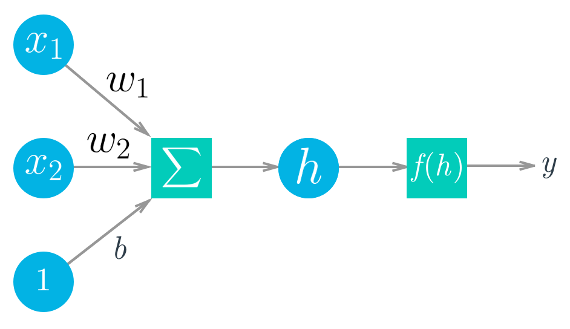
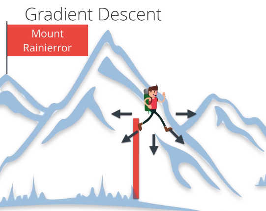

# Facebook_Udacity
### [01](https://github.com/TanishB/Facebook_Udacity/tree/master/01_DeepLearning%20With%20PyTorch)  DeepLearning with PyTorch
> This folder contains the following notebooks :-
> 1. [Introduction To DeepLearning](https://github.com/TanishB/Facebook_Udacity/blob/master/01_DeepLearning%20With%20PyTorch/01_Intro%20To%20DeepLearning.ipynb) 
In this notebook you'll get introduced to PyTorch & basic mathematics behind neural networks.

> 2. [Neural Networks in PyTorch : MNIST](https://github.com/TanishB/Facebook_Udacity/blob/master/01_DeepLearning%20With%20PyTorch/02_Neural%20Networks%20in%20PyTorch.ipynb) 
Building a simple neural network using MNIST dataset.

> 3. [Training Neural Networks](https://github.com/TanishB/Facebook_Udacity/blob/master/01_DeepLearning%20With%20PyTorch/03_Training%20Neural%20Networks%20MNIST.ipynb) 
In this notebook you'll learn how to train a neural network.

> 4. [FASHION MNIST](https://github.com/TanishB/Facebook_Udacity/blob/master/01_DeepLearning%20With%20PyTorch/04_Fashion%20MNIST.ipynb)
MNIST is simple so here you'll build a deep learning model using FashionMNIST dataset, which is a bit complex to train.

> 5. [Inference & Validation](https://github.com/TanishB/Facebook_Udacity/blob/master/01_DeepLearning%20With%20PyTorch/05_Inference%20And%20Validation.ipynb)
In this notebook you'll learn about Validation, overfitting and Dropout(method to prevent overfitting)

> 6. [Loading Image Data](https://github.com/TanishB/Facebook_Udacity/blob/master/01_DeepLearning%20With%20PyTorch/07_Loading_Image_Data.ipynb)
In this notebook you'll learn How to Load Image Data using torchvision ImageFolder

> 7. [Transfer Learning](https://github.com/TanishB/Facebook_Udacity/blob/master/01_DeepLearning%20With%20PyTorch/08_Transfer_Learning.ipynb)
In this notebook you'll learn about Transfer Learning, using pretrained networks.

### [02](https://github.com/TanishB/Facebook_Udacity/tree/master/02_IntroducingDifferentialPrivacy) Introduction to Differential Privacy
> This folder contains the following notebook :-
> 1. [Parallel Databases](https://github.com/TanishB/Facebook_Udacity/blob/master/02_IntroducingDifferentialPrivacy/Parallel%20Databases.ipynb) 
In this notebook, you'll get to know when can we say Privacy is preserved and you'll also learn about parallel databases
